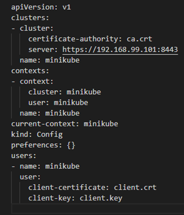
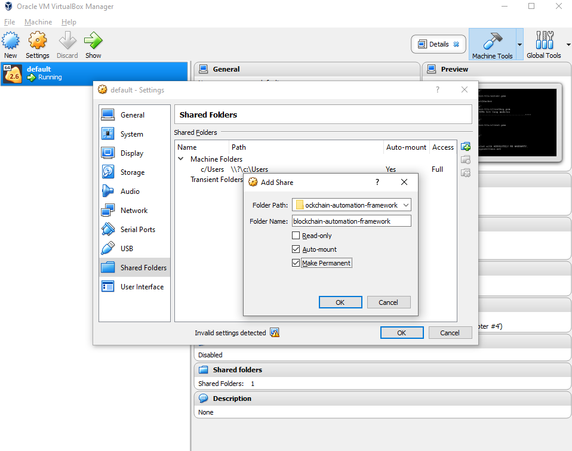

# Running BAF DLT network on Minikube

## Clone forked repo
1. If not already done, clone your forked repo on your machine.

   ```bash
   cd ~/project
   git clone git@github.com:<githubuser>/blockchain-automation-framework.git
   ```
1. Add a “local” branch to your machine
   ```bash
   cd ~/project/blockchain-automation-framework
   git checkout -b local	
   git push --set-upstream origin local
   ```

## Update kubeconfig file
1. Create a “build” folder inside your BAF folder.
   ```bash
   cd ~/project/blockchain-automation-framework
   mkdir build
   ```
1. Copy ca.crt, client.key, client.crt from ~/.minikube to build.
   ```bash
   cp ~/.minikube/ca.crt build/
   cp ~/.minikube/client.key build/
   cp ~/.minikube/client.crt build/
   ```
   ---
   **NOTE**: If you ever delete and recreate minikube, the above step has to be repeated.

   ---
1. Copy gitops file from ~/.ssh to build. (This is the private key file which you used to authenticate to your GitHub in pre-requisites)
   ```bash
   cp ~/.ssh/gitops build/
   ```
1. Copy ~/.kube/config file to build.
   ```bash
   cp ~/.kube/config build/
   ```

1. Open the above config file and remove the paths for certificate-authority, client-certificate and client-key as in the figure below.

   


### Additional Windows configurations
1. Ensure that you have set the following git config before cloning the repo. 
   ```bash
   git config --global core.autocrlf false
   ```
   
1. If not, update the EOL to LF for platforms/hyperledger-fabric/scripts/*.sh files.

1. Execute following to correctly set docker environment.
   ```bash
   eval $('docker-machine.exe' env)
   ```
<a name = "windows_mount"></a>
1. Mount windows local folder (blockchain-automation-framework folder) to VirtualBox docker VM ( the machine named “default” by default) from right-click menu, Settings -> Shared Folders. All paths in network.yaml should be the mounted path. Shut down and restart the "default" machine after this.

   

## Edit the configuration file

1. Choose the DLT platform you want to run and copy the relevant sample network.yaml to build folder; rename it to network.yaml.

   For Fabric, use `platforms/hyperledger-fabric/configuration/samples/network-minikube.yaml`
   ```bash
   cd ~/project/blockchain-automation-framework
   cp platforms/hyperledger-fabric/configuration/samples/network-minikube.yaml build/network.yaml
   ```

1. Edit the following configurations in the `network.yaml` correctly:
   ```yaml
   docker:
      url: "index.docker.io/hyperledgerlabs"
      username: “<your docker username>"
      password: "<your docker password/token>"
   ```
1. For each `organization`, update the following: (there are 3 organizations in this sample network.yaml)
   ```yaml
   vault:
      url: http://<Your Vault server address>:8200 (Use the local IP address rather than localhost)
      root_token: <your vault_root_token>
   gitops:
      git_ssh: <ssh url of your forked repo>
      git_push_url: <https url of your forked repo without the https://)
      username: "<github_username>"          
      password: "<github_token>"         
      email: "<github_email>"
   ```

1. Deploying the sample “supplychain” chaincode is optional, so you can delete the “chaincode” section. If deploying chaincode, update the following for the peers.
   ```yaml
   chaincode:
      repository:
         username: "<github_username>"
         password: "<github_token>"
   ```

## Execute
Run the following command to deploy BAF Fabric on minikube
```bash
docker run -it -v $(pwd):/home/blockchain-automation-framework/ hyperledgerlabs/baf-build
```
Windows users should use following (make sure that the local volume was mounted as per [this step](#windows_mount)):
```bash
docker run -it -v /blockchain-automation-framework:/home/blockchain-automation-framework/ hyperledgerlabs/baf-build
```

---
**NOTE:** If you need public address for nodes in your `network.yaml` file, you can use the output of `minikube ip`
